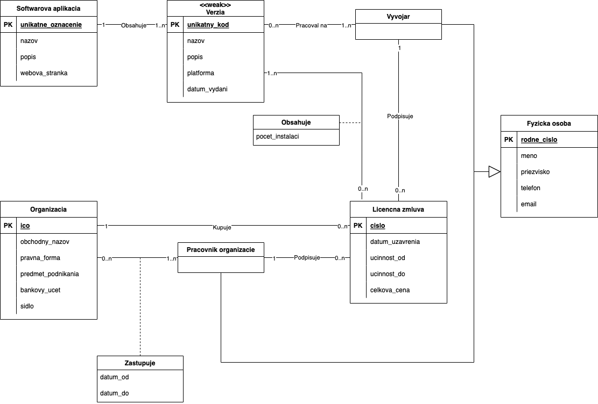
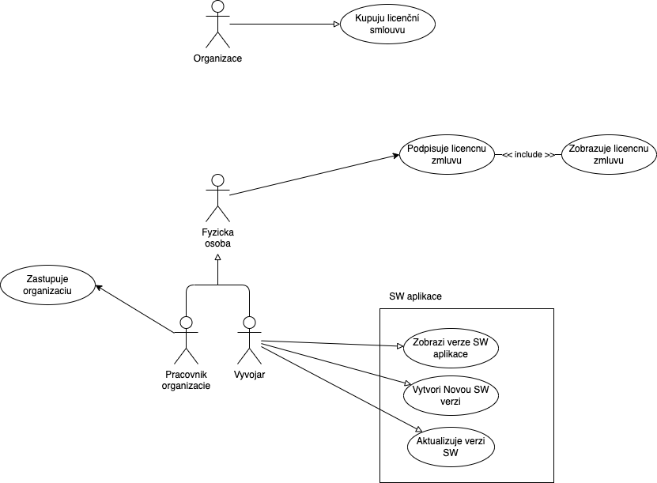

# IDS Projekt 1
Ako zadanie sme sa rozhodli pokračovať na prvom projekte z predmetu IUS - Zadanie Licence.

## Autoři:
- Jáchym Doležal - xdolez0c
- Šimon Benčík - xbenci01
## Datum
11.3.2023
## ER diagram

### Popis Entit
#### Softwarová aplikace
Atributy:
- PK unikátní označení
- název
- popis
- webová stránka
#### Verze (weak)
Atributy:
- PK unikátny kód
- název
- popis
- platforma
- datum vydání
#### Vyvojář
Dědí atributy z fyzické osoby, vlastní atributy nemá.
#### Fyzická osoba
Atributy:
- PK rodné číslo
- jméno
- příjmení
- telefon
- e-mail
#### Licenční smlouva
Atributy:
- PK číslo
- datum uzavření
- účinnost od
- účinnost do
- celková cena
#### Pracovník organizace
Dědí atributy z fyzické osoby, vlastní atributy nemá.
#### Organizace
Atributy:
- PK ičo
- obchodní název
- právní forma
- předmět podnikání
- bankovní účet
- sídlo

### Popis vztahů
- 1 Softwarová aplikace obsahuje 1 až N Verzi
- 1 až N Vyvojářů může pracovat na 0 až N verzích
- 1 vývojář alebo pracovník organizácie podepisuje 0 až N licenčních smluv
- 0 až N licenčných zmlúv obsahuje počet inštalácií pre 1 až N verzií
- Vývojář a Pracovník organizace dědí atributy z Fyzické osoby. Vytváří tedy vztah generalizace/specializace
- 1 Organizácia kupuje 0 až N licenčných zmlúv
- Organizáciu zastupuje v určitom časovom rozmedzí 1 až N pracovníkov

## Usecase diagram

### Popis
Aktéri:
- Vývojár
- Pracovník organizácie
- Fyzická osoba
- Organizácia
Generalizácia: Pracovník organizácie a vývojár generalizuje na fyzickú osobu.

#### Vývojar
Pracuje na verzii SW aplikácie a teda zobrazuje verzie SW aplikácie, vytvára nové verzie, aktualizuje verzie.

#### Pracovnik organizácie
Jeho hlavnou úlohou je zastupovanie organizácie.

#### Fyzická osoba
Je generalizáciou aktérov Vyvojár a Pracovník organizácie a môže navyše zobrazovať a podpisovať licenčnú zmluvu.

#### Organizácia
Kupuje licenčné zmluvy.